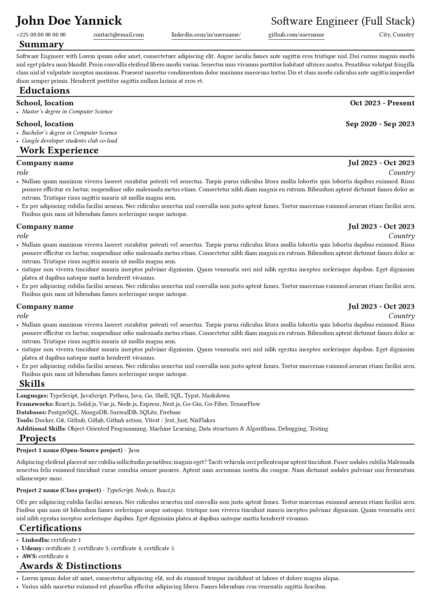

# DESCRIPTION

This project provides a customizable resume template written in the Typst language, designed for generating high-quality PDFs. Leveraging the Typst compiler, the template allows users to easily create professional resumes tailored to their needs.



## Project Structure

- `.gitignore` : File to ignore certain files and folders in version control.
- `headers.typ` : Contains headers used in the resume.
- `links.typ` : Contains links used in the resume.
- `README.md` : This file.
- `resume.typ` : Main file containing the content and configuration of the resume.
- `Times_New_Roman.ttf` : Font used in the resume.

## Content of `resume.typ`

The `resume.typ` file contains the following sections:

- **IMPORTS** : Importing `headers.typ` and `links.typ` files.
- **VARIABLES** : Declaration of variables used in the resume.
- **CONFIGURATIONS** : Page configuration, font, and text justification.
- **HEADER** : Resume header with name, title, contact information, and links to LinkedIn and GitHub.
- **SUMMARY SECTION** : Summary section.
- **CERTIFICATIONS SECTION** : Certifications section.
- **AWARDS & DISTINCTIONS SECTION** : Awards and distinctions section.

## Instructions
1. Clone the repository.
2. Modify the .typ files to customize your resume.
3. Use a compatible tool to generate the resume in PDF format from resume.typ or use this command:
   ```bash
    typst compile resume.typ
   ```

## Author
  KOUAKOU KOUAME Yannick - [LinkedIn](https://www.linkedin.com/in/yannick-k-946970200/) - [GitHub](https://github.com/yannick2009)
